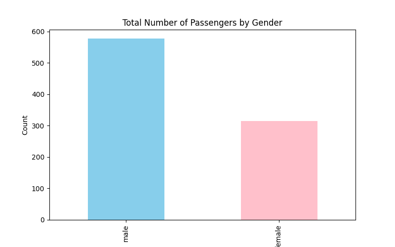
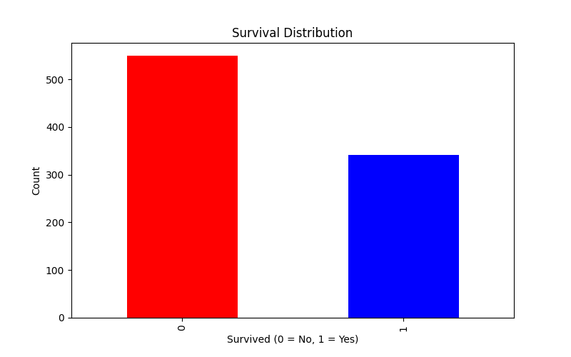
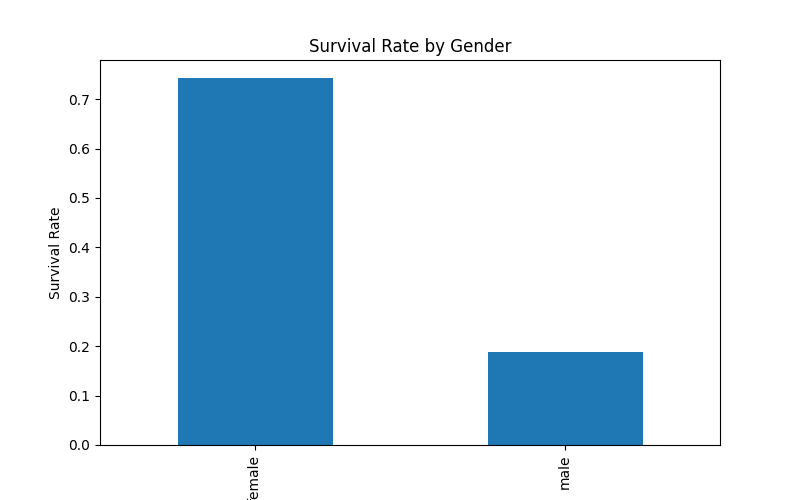
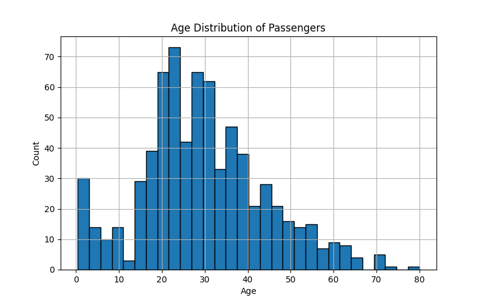
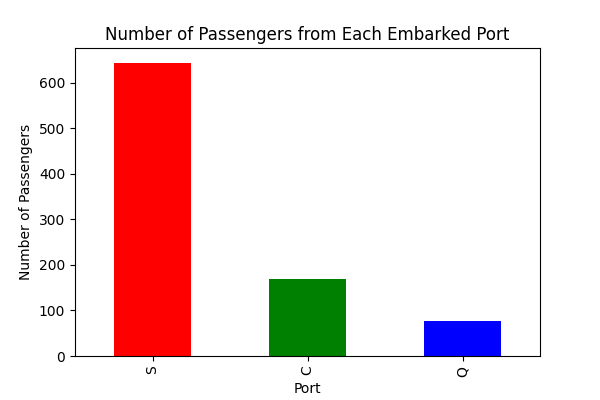
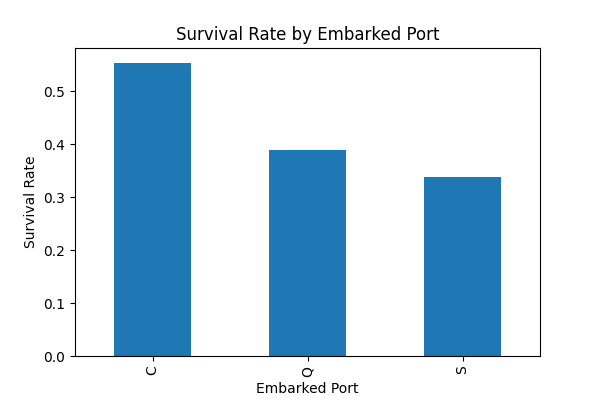

# Titanic-Survival-Prediction-using-FastAPI-Streamlit
# Titanic Survival Predictor

A machine learning project that predicts whether a passenger would have survived the Titanic disaster using historical passenger data. The project includes **EDA**, **feature engineering**, **model training**, a **FastAPI backend**, and a **Streamlit frontend** for real-time predictions.

---

## Table of Contents

- [Project Overview](#project-overview)  
- [Dataset](#dataset)  
- [Exploratory Data Analysis (EDA)](#exploratory-data-analysis-eda)  
- [Feature Engineering](#feature-engineering)  
- [Model Training](#model-training)  
- [Model Performance](#model-performance)  
- [API Usage](#api-usage)  
- [Streamlit App Usage](#streamlit-app-usage)  
- [Project Structure](#project-structure)  
- [Future Improvements](#future-improvements)

---

## Project Overview

This project aims to:

- Analyze the Titanic dataset to understand patterns influencing survival.
- Build a machine learning model to predict survival.
- Provide an interactive web interface using Streamlit.
- Offer a RESTful API via FastAPI for real-time predictions.

The model uses features such as **Pclass, Age, Sex, Family Size, Fare, Embarked Port, Title, Cabin information, and whether a passenger was alone**.

---

## Dataset

The dataset is the classic **Titanic dataset** from Kaggle containing 891 records with features like:

- `PassengerId`, `Survived`, `Pclass`, `Name`, `Sex`, `Age`, `SibSp`, `Parch`, `Ticket`, `Fare`, `Cabin`, `Embarked`.

---

## Exploratory Data Analysis (EDA)

Key visualizations and insights:

1. **Passenger Gender Distribution**  

   

2. **Survival Distribution**  

   

3. **Survival Rate by Gender**  

   

4. **Age Distribution**  

   

5. **Embarked Port Analysis**  

     
   

6. **Family and Fare Analysis**  

   - Survival rate by `SibSp`, `Parch`, and `FamilySize`  
   - Fare distribution visualization  

---

## Feature Engineering

Key transformations:

- Extracted **Title** from passenger names (`Mr`, `Miss`, `Mrs`, `Master`, `Other`).  
- Created `HadCabin` to indicate cabin presence.  
- Created `FamilySize` and `IsAlone` features.  
- Encoded categorical variables: `Sex`, `Embarked`, and `Title`.

---

## Model Training

- **Model Used**: Random Forest Classifier  
- **Hyperparameters**:
  - n_estimators=100`
  - max_depth=5`
  - min_samples_split=5`
  - min_samples_leaf=2`
  - random_state=42`

```python
model.fit(X_train, y_train)
y_pred = model.predict(X_test)
```
---
## Model Performance

The trained model achieves:

Accuracy: 83%

Precision:

Class 0 → 0.84

Class 1 → 0.81

Recall:

Class 0 → 0.88

Class 1 → 0.76

F1-Score:

Class 0 → 0.86

Class 1 → 0.78

---

